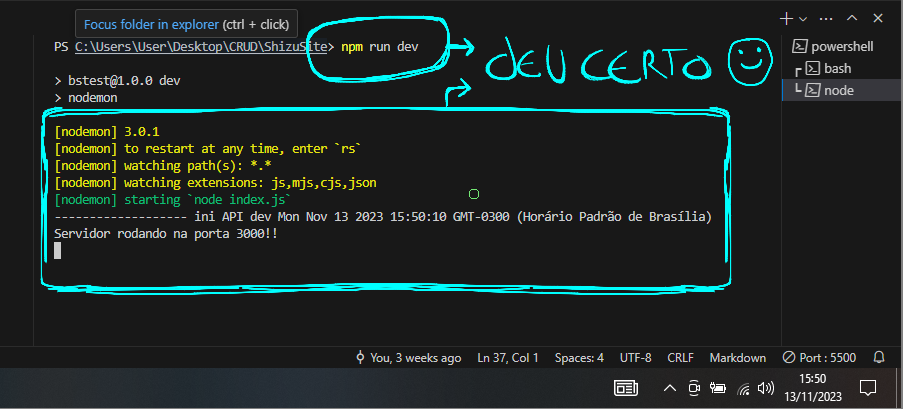
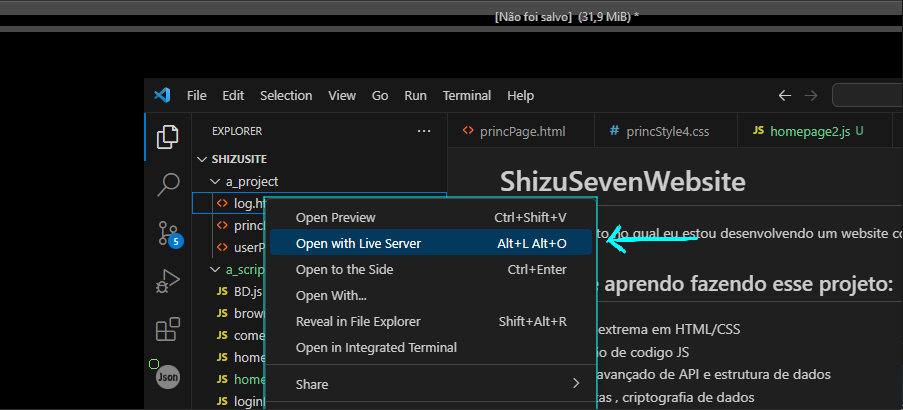
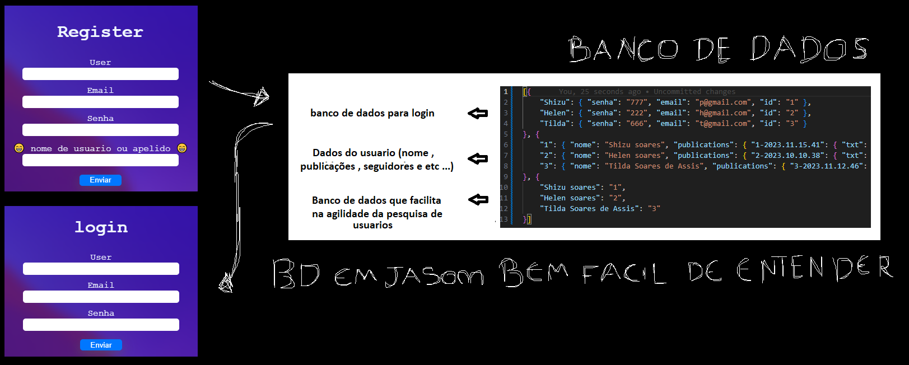

# ShizuSevenWebsite
Este é um projeto no qual eu estou desenvolvendo um website com o objetivo de aprimorar minhas habilidades em JS, HTML, CSS e Node.js.

## coisas que aprendo fazendo esse projeto:
- melhoria extrema em HTML/CSS
- otimização de codigo JS
- conceito avançado de API e estrutura de dados
- http, portas , criptografia de dados 
- sistema de cliente / usuarios / Adm
- git e outros recursos

# v2.0.0

## JA ADICIONADO :
- comentarios 
- likes / deslikes
- procurar usuario 
- seguir / parar de seguir 
- posts 
- biografia dinamica
- deletar post
- deletar comentario
- trocar de usuario

## PENDENTE :

# Como usar / testar :
## 1* iniciar a API

## 2* Abrir o log (Extenção Live Server não é obrigatorio)

## como funciona o sistema de login :

